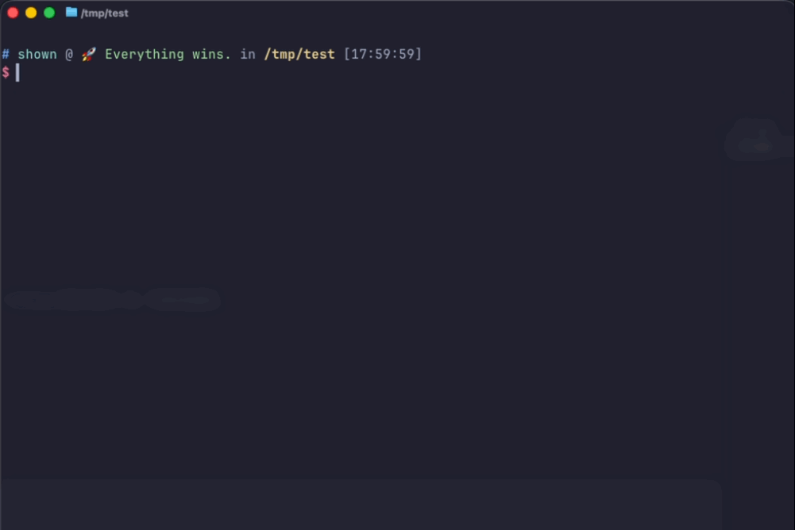

# `@ai`

`@ai` is a local command-line tool that turns a natural language request into a candidate shell command, shows it for review, and only executes it after explicit user confirmation.

<p style="text-align:center;">
  
</p>

This project was built with AI assistance. AI is used to help produce the code and interaction flow, but that does not make generated commands inherently safe. The user remains the final authority on whether a command should run.

The project is organized as three Rust crates:

- `crates/atai-core`: core logic such as config loading, model calls, risk policy, execution, and history
- `crates/atai-cli`: command entrypoint, subcommands, and the TUI review flow
- `crates/atai-tui`: the terminal UI layer used by the CLI crate

## Goals

- Turn natural language requests into reviewable shell commands
- Apply local risk checks before execution
- Support quick regeneration of the same request before execution
- Keep execution authority with the user instead of auto-running commands

## Flow

1. Enter a request such as `@ai find the 5 largest directories in the current folder`
2. The tool calls the model to generate a candidate command
3. The inline terminal view shows a compact status line with elapsed model time, the command, and the current risk level
4. You can execute it, regenerate it, or close the preview directly from the current terminal
5. The local policy engine reads the denylist and confirmation list from `~/.@ai`
6. The command only runs after you confirm it

## Runtime Files

The runtime directory is fixed at:

```text
~/.@ai/
```

The directory must contain at least:

```text
config.toml
system_prompt.txt
command_denylist.txt
command_confirmlist.txt
```

`atai` checks these files on startup. If any required file is missing, it stops and tells you to run `atai config init`.

## Safety Model

The tool uses two layers of control:

- External system prompt: loaded from `~/.@ai/system_prompt.txt`
- Local policy enforcement: executed before running the command and not based on model self-reporting

### Hard Deny Rules

Commands are denied immediately if they match any of these conditions:

- Dynamic execution: `eval`, `source`, backticks, `$()`
- Unsupported shell features: here-docs, background execution, shell function definitions, multi-line commands, `;` command chaining
- Catastrophic deletion patterns such as `rm -rf /`, `rm -rf ~`, or `rm -rf $HOME`
- Any keyword match from `command_denylist.txt`

### Extra Confirmation Rules

Commands are shown but require extra confirmation if they match any of these conditions:

- Output redirection to regular files such as `>` or `>>`
- Possible writes outside the current working directory
- Any keyword match from `command_confirmlist.txt`

## Confirmation Logic

- Safe command: press `Enter` to execute immediately
- High-risk command: press `Enter` once to arm execution, then press `Enter` again to run it
- Denied command: execution is blocked; use `Ctrl+R` to regenerate or `Enter` to close
- Press `Ctrl+E` as an alternative execute key
- Press `Ctrl+C` or `Ctrl+Q` to quit immediately

## Configuration

Default config path:

```toml
~/.@ai/config.toml
```

Example configuration:

```toml
[model]
endpoint = "https://api.openai.com/v1"
model = "gpt-5.4"
api_key = "${OPENAI_API_KEY}"
timeout_seconds = 60

[execution]
shell = "/bin/zsh"

[safety]
mode = "tiered"

[history]
enabled = false
max_entries = 200
redact_paths = true
```

### `api_key` Resolution

- `api_key = "${OPENAI_API_KEY}"`: read `OPENAI_API_KEY` from the environment
- `api_key = "sk-xxx"`: use the literal string directly

Using an environment variable is recommended so the real key is not stored on disk.

## Commands

After installation, the main workflow is:

```bash
@ai find the 5 largest directories in the current folder
```

Built-in commands:

```bash
atai version
atai config
atai config show
atai config init
```

- `atai version`: print the binary version
- `atai config` / `atai config show`: print the current config and runtime resource paths; `api_key` is masked for display
- `atai config init`: initialize `~/.@ai` and generate `config.toml`, `system_prompt.txt`, the command denylist, and confirmation list

Example initialization:

```bash
mkdir -p ~/.@ai
atai config init
atai config show
```

You can also generate without entering the TUI:

```bash
atai --print-only find the 10 largest files in the current directory
```

### Inline View Keys

- `Enter`: execute the command; high-risk commands require pressing it twice
- `Ctrl+E`: alternative execute key; high-risk commands require pressing it twice
- `Ctrl+R`: regenerate the candidate command for the same request
- `Ctrl+C` / `Ctrl+Q`: quit immediately without executing
- `Esc`: cancel a pending high-risk execution confirmation

## Build And Install

```bash
make help
make build
make fmt-check
make check
make test
make fmt
make clippy
make verify
make install
```

The default install location is `~/.local/bin`:

- `atai`: the Rust binary
- `@ai`: a wrapper script that forwards to `atai` in the same directory

If `~/.local/bin` is not in your `PATH`, add it before using the installed command.

## GitHub Releases

The repository publishes a dated release from GitHub Actions on every push to `main` and on manual workflow runs launched from `main`.

- Release tag format: `vYYYY.MM.DD`
- Release assets: `x86_64-unknown-linux-gnu`, `x86_64-apple-darwin`, and `x86_64-pc-windows-msvc`
- Re-running the workflow on the same day updates the same release and refreshes the tag to the latest commit on `main`

## Make Targets

- `make help`: show available targets
- `make build`: build the binary for the selected profile, default `release`
- `make run RUN_ARGS='find the largest directories'`: run locally
- `make test`: run tests
- `make fmt`: rewrite files with `rustfmt`
- `make fmt-check`: check formatting without rewriting files
- `make check`: run `cargo check --workspace --all-targets --all-features`
- `make clippy`: run `clippy` with warnings denied
- `make verify`: run `fmt-check`, `check`, `clippy`, and `test`
- `make install`: install `atai` and `@ai`
- `make clean`: remove build artifacts

## License

This project is licensed under GNU GPL v3.0 only. See [LICENSE](/Users/shown/workspace/@AI/LICENSE).

## Current Limits

- Release artifacts are published for Linux, macOS, and Windows
- The generated commands still assume POSIX shell semantics by default
- Only supports OpenAI-compatible `Responses API` endpoints
- The inline review view only handles preview and confirmation; execution output is printed after it exits
